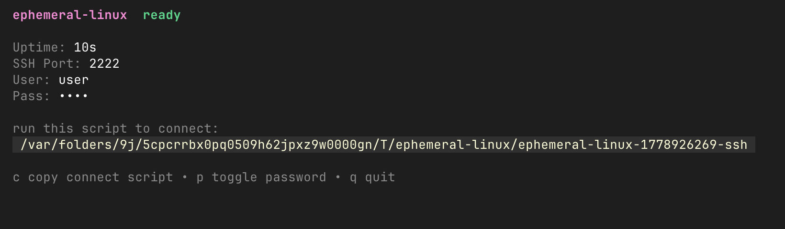

# ephemeral-linux

A tiny Go TUI app written using Bubble Tea for spinning up a quick bare-bones Linux box I can SSH into from macOS to mimic my university OS exam server.



## Install

Go is required.

```bash
go install github.com/katistix/ephemeral-linux/cmd/ephemeral-linux@latest
```

## Run

```bash
ephemeral-linux
```

If your Go bin directory is not in your `PATH`, run:

```bash
~/go/bin/ephemeral-linux
```

## Requirements

- Docker installed and running

## Defaults

- user: `user`
- password: `pass`
- SSH port: `2222`

## What's baked in

First run takes a bit longer because the app builds the image once. After that it starts much faster.

Included in the image:

- OpenSSH server
- GCC, Make, Valgrind
- man pages
- common Unix tools like grep, sed, find, awk, less, and vim

## Notes

- the container is temporary and is removed when you quit the TUI
- the app creates a temporary local SSH wrapper command so fresh host keys do not pollute `known_hosts`
- intended for local use only

